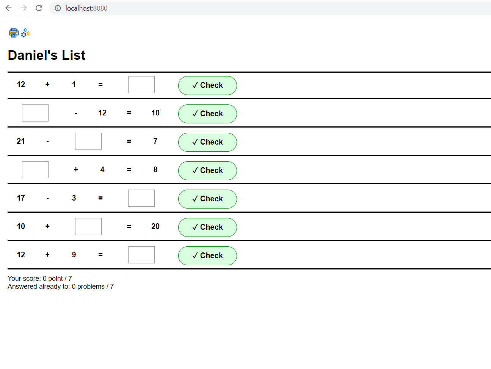
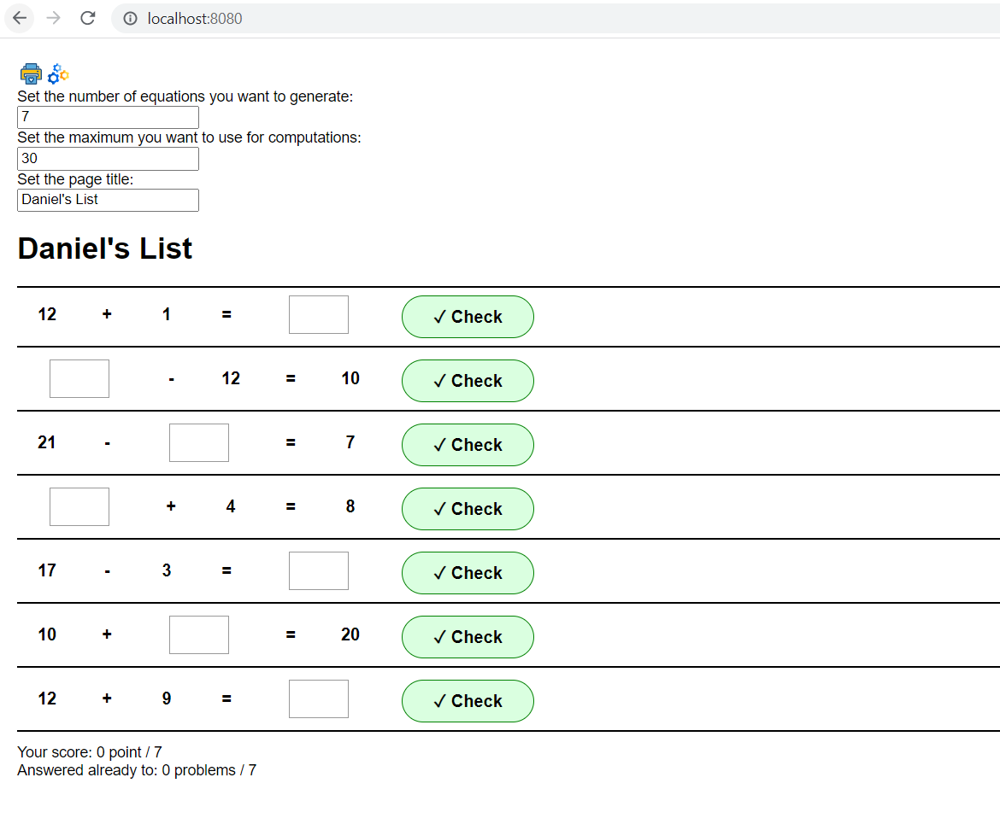
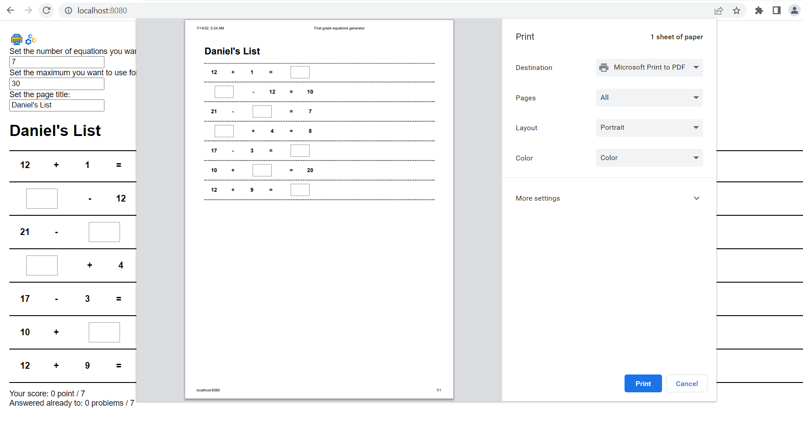

## Project: Generate first grate equations

They can be used by small kids on school to invent problems

Example:
10 - ? = 2

=> |**We bought 10 apples. How many were eaten if now we have only 2?**

## Deployment

**[See the app here!](https://abcles.github.io/1st_grade_equations/dist/)**

## Prerequisites

1. Are covered the plus and minus operations
2. The sum/difference should cover **positive** numbers until **30** (can be changed).

## Take is account the extremas:

Examples:

- if the first number generated for + si 30, the second can be only 0
- if the first number generated for - is 0, the second can be only 0

|what problem can be generated from 30-0 or 30+0? --> still, cover this case

|what problem can be generated from 0-0 or 0+0 ? --> don't start generating numbers from 0

## Algorithm

1. Generate the first member (VALUE1), random between MIN_LIMIT = 1 and MAX_LIMIT = 30

2. Generate the sign, if it would be + or -

3. Generate for +, a second number between 0 and MAX_LIMIT - VALUE1

- why 0? to cover also the time when VALUE1 === MAX_LIMIT

4. Generate for -, a second number between 0 and VALUE1-MIN_LIMIT. In this way we are sure to use only positive numbers

5. Generate where the UNKNOWN_VALUE to be shown, in the **first member**, **second member** or **result** position

**Note**: for -, the operation is changed in +, if the position is for member, and viseversa for the + operation

## Screenshots

## Install on local host

1. Get the code
2. `npm install`
3. `npm start`
